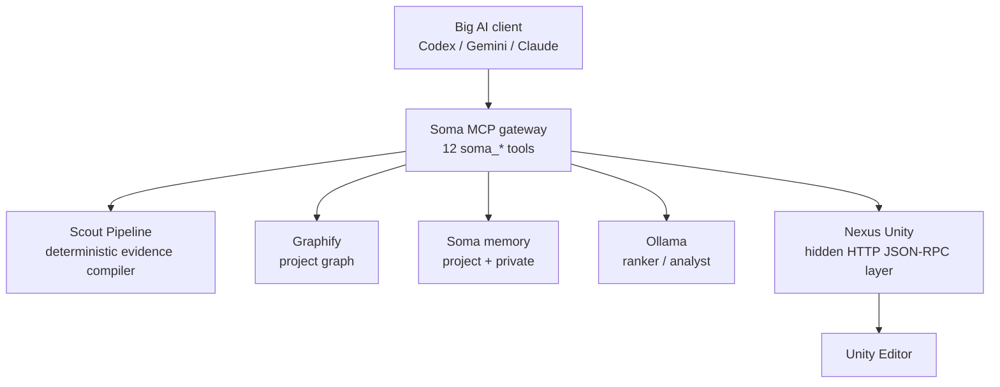

# Soma

Soma is a local-first evidence compiler and MCP gateway for large coding models such as Codex, Gemini, Claude, GPT-5.5, Opus, and Gemini Pro.

The current product direction is **NexusSoma**:

```text
Big AI client
  -> Soma MCP gateway
  -> deterministic Scout Pipeline
  -> Graphify project graph
  -> optional local model ranker/analyst
  -> hidden Nexus Unity tools when Unity is online
```

The goal is not to replace Big AI with a small local model. The goal is to make Big AI spend fewer tokens by giving it exact, compact, evidence-backed packets instead of raw repo dumps, full diffs, long logs, full Unity scene dumps, or 85+ raw Nexus tool definitions.

## Current Status

| Area | Status |
|---|---|
| Soma MCP gateway | Implemented in `Soma/soma_mcp_server.py` |
| Public MCP catalog | Stable at 12 `soma_*` tools |
| Swift app controls | Start/stop/status/config/live verify implemented |
| Codex config install/verify/rollback | Implemented, explicit only |
| Gemini/Claude config | Copy-only snippets |
| Nexus Unity | Hidden behind Soma tools; currently requires manual Unity server start |
| Graphify | Project graph support implemented |
| Local models | Optional after deterministic compression |
| Current tests | Python suite last known: `30 tests OK` |
| Current build | Swift build last known: succeeded |

Important current truth:

- Real Codex config may still expose direct Nexus until `Install Codex` is clicked in the Soma app.
- Nexus Unity live calls require opening Unity and starting the Nexus server manually.
- Deterministic Soma packets still work when Ollama or Nexus is offline.

For the detailed engineering report covering Etap 1-4, read:

```text
/Users/daliys/Daliys/Swift/Soma/reportD.md
```

## Why Soma Exists

Big AI workflows are expensive and noisy when they start from raw codebases and raw Unity tooling:

- Raw Nexus Unity exposes a very large tool catalog.
- Big AI spends tokens reading tool schemas before doing useful work.
- Exploration often takes many turns before the model sees the relevant files or scene objects.
- Full diffs, full logs, and full component dumps are too large and usually unnecessary.
- Every new session rediscovers project structure unless there is a durable map.

Soma changes that workflow:

```text
Use local deterministic tools first.
Select evidence.
Apply strict budgets.
Summarize omissions.
Use Graphify and memory for durable context.
Use local models only after context is compact.
Expose only Soma tools to Big AI.
```

Expected Big AI behavior:

```text
Use the Soma packet first.
If insufficient, ask for exactly 1-3 missing files, objects, or commands.
Do not scan the whole repo or call raw Unity tools.
```

## Architecture



### Main Components

| Component | Path | Purpose |
|---|---|---|
| Swift app | `Soma/ContentView.swift` | Project selection, MCP server lifecycle, config actions, live verify status |
| Soma MCP server | `Soma/soma_mcp_server.py` | Single MCP gateway exposed to Big AI |
| Scout Pipeline | `Soma/scout_pipeline.py` | Deterministic packet compilation and optional ranker/analyst stages |
| Live verifier | `Soma/verify_soma_live_workflow.py` | Real stdio MCP smoke and live Unity acceptance |
| Local relay | `Soma/relay.py` | Optional local chat/relay path |
| Benchmark harness | `Soma/benchmark_ollama.py` | Local model timing and JSON reliability checks |
| Tests | `tests/` | Python regression coverage |

## Public Soma MCP Tools

Big AI should see these tools only:

| Tool | Purpose |
|---|---|
| `soma_prepare_context` | Main bounded evidence packet for implementation/debug/review |
| `soma_get_map` | Living project briefing from git, graph, Nexus, and memory |
| `soma_ask` | Graph-backed project Q&A |
| `soma_code_context` | Focused source snippets and graph context |
| `soma_scene` | Compact Nexus Unity scene snapshot |
| `soma_inspect` | Filtered Unity object/component inspection |
| `soma_debug` | Debug evidence from code, git, logs, and health |
| `soma_review` | Review packet for current diff or focus area |
| `soma_delta` | Git status plus Nexus timeline/scene delta |
| `soma_apply` | Unity code write plus compilation check through Nexus |
| `soma_execute` | Restricted Nexus batch escape hatch |
| `soma_remember` | Structured memory save/list/clear |

Raw `unity_*` tools should not be visible to Big AI in the Soma workflow.

## Packet Modes

Soma routes prompts into packet modes:

| Mode | Use Case | Evidence Priority |
|---|---|---|
| `direct` | No local evidence needed | prompt-only packet |
| `changes` | “what changed?” | git status, changed files, top hunks |
| `debug` | crash/error/broken behavior | logs, errors, related source, configs |
| `review` | bugs/regressions/risks | current diff, changed hunks, risky files |
| `implementation` | change code | explicit files, related source, tests |

## Token Budgets

Every packet should respect a budget:

| Budget | Intended Use |
|---|---|
| `micro` | quick status/map snippets, around 1k tokens |
| `fast` | simple tasks/debug, around 2.5k tokens |
| `balanced` | default work, around 6k tokens |
| `deep` | explicit architecture/debug investigations, around 15k tokens |
| `full` | rare explicit request only, around 30k tokens |

Raw full diffs, full logs, full scene dumps, and full component dumps are forbidden by default. Large omissions must be reported through the `omitted` section.

## Local Model Policy

Default path:

```text
deterministic only
```

Optional local model stages:

```text
preflight -> deterministic -> optional ranker -> optional analyst
```

Current defaults:

```text
SOMA_LOCAL_MODEL=gemma4:e4b
SOMA_RANKER_MODEL=gemma4:e4b
SOMA_ANALYST_MODEL=qwen3-coder:30b-a3b-q4_K_M
```

Rules:

- Deterministic packet generation must work without Ollama.
- Ranker failure must not block deterministic packets.
- Analyst failure must not block deterministic packets.
- Local model output may reorder or annotate evidence, but cannot invent unsupported facts.
- The deterministic packet builder remains the final authority.

Recommended Ollama runtime:

```bash
OLLAMA_CONTEXT_LENGTH=4096 \
OLLAMA_MAX_LOADED_MODELS=1 \
OLLAMA_NUM_PARALLEL=1 \
OLLAMA_FLASH_ATTENTION=1 \
OLLAMA_KV_CACHE_TYPE=q8_0 \
OLLAMA_KEEP_ALIVE=30m \
ollama serve
```

## Swift App Workflow

1. Open the app from Xcode:

   ```bash
   open /Users/daliys/Daliys/Swift/Soma/Soma.xcodeproj
   ```

2. Select a project root, for example:

   ```text
   /Users/daliys/Daliys/UnityProjects/UnityTestForNexus
   ```

3. Use the MCP Gateway panel:

   | Action | Purpose |
   |---|---|
   | Start | Start Soma MCP stdio server for selected root |
   | Stop | Stop app-launched server |
   | Refresh | Refresh Soma/Nexus/Graphify status |
   | Verify Client | Verify Codex config points to Soma only |
   | Install Codex | Back up and install Soma-only Codex config |
   | Rollback Codex | Restore latest Codex backup |
   | Run Live Verify | Run real MCP workflow and live Unity checks |
   | Copy Config | Copy config snippets for Codex/Gemini/Claude |

4. Connect Big AI to Soma only.
5. Use `soma_get_map` or `soma_prepare_context` before implementation/review/debug work.

## CLI Usage

### Status

```bash
cd /Users/daliys/Daliys/Swift/Soma
/opt/homebrew/bin/python3 Soma/soma_mcp_server.py \
  --status-json \
  --project-root /Users/daliys/Daliys/UnityProjects/UnityTestForNexus
```

### Print Client Config

```bash
/opt/homebrew/bin/python3 Soma/soma_mcp_server.py \
  --print-client-config codex \
  --project-root /Users/daliys/Daliys/UnityProjects/UnityTestForNexus
```

Supported clients for copy-only config output:

```text
codex
gemini
claude
```

### Install, Verify, Roll Back Codex Config

```bash
/opt/homebrew/bin/python3 Soma/soma_mcp_server.py \
  --install-codex-config \
  --project-root /Users/daliys/Daliys/UnityProjects/UnityTestForNexus
```

```bash
/opt/homebrew/bin/python3 Soma/soma_mcp_server.py \
  --verify-client-config codex
```

```bash
/opt/homebrew/bin/python3 Soma/soma_mcp_server.py \
  --rollback-codex-config
```

### Live Verifier

Offline-safe smoke:

```bash
/opt/homebrew/bin/python3 Soma/verify_soma_live_workflow.py \
  --project-root /Users/daliys/Daliys/UnityProjects/UnityTestForNexus
```

Live Unity acceptance, after starting Nexus Unity in the editor:

```bash
/opt/homebrew/bin/python3 Soma/verify_soma_live_workflow.py \
  --project-root /Users/daliys/Daliys/UnityProjects/UnityTestForNexus \
  --live-unity \
  --run-apply \
  --cleanup-apply
```

Use `--strict-exit` in CI-like checks when degraded output should fail the process.

### Direct Scout Pipeline

Deterministic gather:

```bash
PYTHONDONTWRITEBYTECODE=1 /opt/homebrew/bin/python3 Soma/scout_pipeline.py \
  "do we have bugs?" \
  --mode gather \
  --project-root /Users/daliys/Daliys/Swift/Soma \
  --recent-roots-json '[]' \
  --token-budget fast \
  --analysis-depth deterministic
```

Ranked gather:

```bash
SOMA_LOCAL_MODEL=gemma4:e4b \
SOMA_RANKER_MODEL=gemma4:e4b \
PYTHONDONTWRITEBYTECODE=1 /opt/homebrew/bin/python3 Soma/scout_pipeline.py \
  "do we have bugs?" \
  --mode gather \
  --project-root /Users/daliys/Daliys/Swift/Soma \
  --recent-roots-json '[]' \
  --token-budget fast \
  --analysis-depth ranked
```

Analyst gather:

```bash
SOMA_LOCAL_MODEL=gemma4:e4b \
SOMA_RANKER_MODEL=gemma4:e4b \
SOMA_ANALYST_MODEL=qwen3-coder:30b-a3b-q4_K_M \
PYTHONDONTWRITEBYTECODE=1 /opt/homebrew/bin/python3 Soma/scout_pipeline.py \
  "do we have bugs?" \
  --mode gather \
  --project-root /Users/daliys/Daliys/Swift/Soma \
  --recent-roots-json '[]' \
  --token-budget fast \
  --analysis-depth analyst
```

## Nexus Unity Workflow

Soma composes Nexus Unity instead of exposing raw Nexus tools to Big AI.

For live Unity work:

1. Open UnityTestForNexus.
2. Open `Window > Nexus Unity`.
3. Click `START SERVER`.
4. In Soma, click `Refresh`.
5. Confirm Nexus is connected.
6. Run `Run Live Verify`.

When online, Soma can call Nexus for:

- compact scene snapshots
- filtered object/component inspection
- logs
- timeline/scene delta
- `apply_code_change`
- restricted batch cleanup

## Graphify

Soma uses project Graphify outputs when available:

```text
graphify-out/graph.json
graphify-out/GRAPH_REPORT.md
```

Current known Unity graph:

```text
/Users/daliys/Daliys/UnityProjects/UnityTestForNexus/graphify-out/graph.json
```

Current known Soma graph:

```text
/Users/daliys/Daliys/Swift/Soma/graphify-out/graph.json
```

For large Unity graphs, `graph.html` may be skipped by Graphify because the graph exceeds visualization limits. This is not a Soma failure; the JSON graph and report remain useful.

## Testing

Run Python tests:

```bash
cd /Users/daliys/Daliys/Swift/Soma
PYTHONDONTWRITEBYTECODE=1 /opt/homebrew/bin/python3 -m unittest discover -s tests -p 'test_*.py'
```

Expected current result:

```text
Ran 30 tests
OK
```

Run Python compile check:

```bash
PYTHONDONTWRITEBYTECODE=1 /opt/homebrew/bin/python3 -m py_compile \
  Soma/scout_pipeline.py \
  Soma/relay.py \
  Soma/benchmark_ollama.py \
  Soma/soma_mcp_server.py \
  Soma/verify_soma_live_workflow.py
```

Run Swift build:

```bash
cd /Users/daliys/Daliys/Swift/Soma
xcodebuild -project Soma.xcodeproj -scheme Soma -configuration Debug -destination 'platform=macOS' build
```

## Benchmarking

Small local benchmark:

```bash
cd /Users/daliys/Daliys/Swift/Soma
/opt/homebrew/bin/python3 Soma/benchmark_ollama.py --model gemma4:e4b
```

For Soma, the best model is not always the smartest model. The best model:

- returns strict JSON
- follows candidate IDs
- avoids hallucination
- is fast on 1k-4k token prompts
- stays stable after warmup
- improves packet quality enough to justify latency

## Current Limitations

- Real Codex config can still expose direct Nexus until `Install Codex` is clicked.
- Final live Unity acceptance requires starting the Nexus Unity server manually.
- The live verifier proves Soma stdio behavior, but does not yet launch from the exact real Codex config.
- Token savings are architectural/estimated; full telemetry is not first-class yet.
- Graphify queries still use a CLI boundary in the current adapter.
- MLX is not integrated into production.
- Dynamic per-intent tool filtering is deferred because v1 keeps `tools/list` stable.

## Roadmap

### Near Term

- Prove the real installed Codex workflow end to end.
- Add acceptance reports under `~/.soma/acceptance/`.
- Add `--wait-nexus <seconds>` to the live verifier.
- Detect wrong Unity project when Nexus is online.
- Track token savings in `~/.soma/token_stats.json`.
- Show latest acceptance report in Swift.

### Medium Term

- Add Graphify direct/MCP adapter instead of shelling out for queries.
- Add cross-project graph helpers for Soma to Nexus relationships.
- Add safer per-method allowlist for `soma_execute`.
- Improve scene object selection for auto-inspect.
- Add cleanup verification after `soma_apply`.

### Long Term

- Add dynamic tool filtering only if MCP clients support it safely.
- Add richer memory governance.
- Add MLX backend only after gateway and acceptance telemetry stabilize.
- Add graph compaction for very large Unity graphs.
- Add benchmark dashboard comparing raw Nexus sessions versus Soma sessions.

## Security And Privacy

Soma is designed for local processing:

- project scanning happens locally
- repo index is local
- Graphify outputs are local
- Ollama inference is local
- Soma does not call cloud models directly

Important caveat:

If a Soma packet is sent to Codex or another online model, that compact packet leaves the machine. Soma's job is to make that packet smaller and more relevant.

## Operating Rule

```text
Deterministic first.
Small local ranker second.
Deep local analyst only on request.
Big AI remains the decision maker and implementer.
Big AI connects to Soma only.
```

## License

MIT License.
