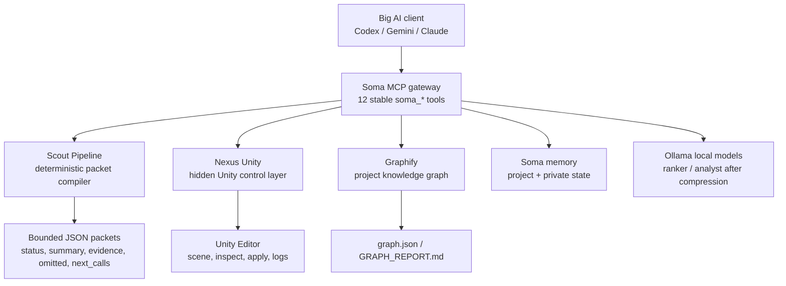

# NexusSoma Implementation Report: Etap 1-4

Generated: 2026-05-05

## 1. Executive Summary

NexusSoma is being built so Big AI clients such as Codex, Gemini, Claude, GPT-5.5, Opus, and Gemini Pro connect to **Soma only**, not directly to raw Nexus Unity. Soma becomes the single MCP gateway that gathers, filters, compresses, and routes project context before expensive models see it.

The core reason for this architecture is token control. Raw Nexus Unity exposes 85+ powerful Unity tools. If those tools are registered directly in a Big AI client, the client pays for large tool schemas, exploratory scene/tool calls, full component dumps, raw logs, raw diffs, and repeated cold-start rediscovery. Soma reduces this by exposing a stable 12-tool catalog, producing compact evidence packets, using deterministic Scout Pipeline compression, enriching with Graphify, and only using local models after context has already been narrowed.

Current state:

| Area | Current Status |
|---|---|
| Soma MCP gateway | Implemented in `/Users/daliys/Daliys/Swift/Soma/Soma/soma_mcp_server.py` |
| Public Soma MCP tools | Stable at 12 `soma_*` tools |
| Raw Nexus exposure through Soma | Hidden behind narrow Soma tools |
| Swift app control panel | Implemented in `/Users/daliys/Daliys/Swift/Soma/Soma/ContentView.swift` |
| Codex config install/verify/rollback | Implemented, but real config has not been changed from terminal |
| Live workflow verifier | Implemented in `/Users/daliys/Daliys/Swift/Soma/Soma/verify_soma_live_workflow.py` |
| UnityTestForNexus graph | Ready and not stale |
| Nexus Unity server | Currently offline |
| Real Codex config | Currently degraded because direct Nexus exposure remains |
| Last Python verification | `30 tests OK` |
| Last Swift verification | `xcodebuild ... build` succeeded |

The architecture is now implemented enough for a real daily workflow trial. The remaining blocker is not the Python gateway or Swift UI; it is live acceptance: start the Nexus Unity server in the Unity editor, install Soma into Codex explicitly, restart Codex, and prove only Soma tools are visible in the real client.

## 2. Original Problem And Architecture Direction

The original problem was that Big AI models spend too many tokens working with large codebases and Unity scenes. The biggest waste sources were:

| Waste Source | Why It Happens | Soma Direction |
|---|---|---|
| Tool definition bloat | Raw Nexus exposes 85+ Unity tools to every MCP client session | Big AI sees only 12 Soma tools |
| Exploratory fishing | Model repeatedly asks what files/scenes/components exist | Soma produces `soma_get_map` and `soma_prepare_context` up front |
| Full component dumps | Raw Unity inspect calls can return far more fields than needed | Soma uses filtered inspect and compact scene snapshots |
| No cross-session memory | Big AI rediscoveries repeat every session | Soma project/private memory and Graphify provide durable context |
| Raw diff/log dumping | Full diffs/logs pollute the chat and inflate context | Soma returns summaries, evidence, omitted counts, and next calls |
| Conversation snowball | Tool output accumulates in the Big AI transcript | Soma returns bounded JSON packets with budgets |

The target design is:

> Big AI talks only to Soma. Soma talks to Scout Pipeline, Nexus Unity, Graphify, memory, and local models.



Important direction choices:

- Keep Nexus powerful but hidden. Do not remove Nexus tools; do not expose them directly to Big AI for the Soma workflow.
- Keep the Soma MCP tool catalog static for v1 because many MCP clients expect `tools/list` to be stable during a session.
- Use deterministic compression first. Local model ranking/analysis is optional and only runs after Scout has narrowed the input.
- Keep Gemini and Claude copy-only for now. Codex is the first client with explicit config mutation because the real Codex config currently contains direct Nexus exposure.

## 3. Etap Summary

| Etap | Goal | Implemented | Current Status |
|---|---|---|---|
| Etap 1 | Build Soma as the single MCP gateway | 12-tool catalog, Nexus client wrapper, Graphify adapter, memory store, compact responses, budgets | Implemented and tested |
| Etap 2 | Make the Swift app control the gateway | Start/stop/status UI, project root environment, config copy actions | Implemented and Swift build passes |
| Etap 3 | Wire Codex install/verify and refresh graph | Codex installer/verifier, MCP stdio workflow verifier, Unity graph refresh | Implemented; real Codex config still degraded until install action |
| Etap 4 | Add rollback and live Unity acceptance flow | Codex rollback, live verifier, smoke apply/cleanup flow, Swift live verify action | Implemented; final live acceptance blocked by offline Nexus server |

## 4. Etap 1: Core Soma MCP Gateway

Etap 1 turned the existing `/Users/daliys/Daliys/Swift/Soma/Soma/soma_mcp_server.py` into the single MCP gateway. The implementation intentionally extended the existing server instead of creating another entrypoint.

The server exposes exactly 12 Soma tools:

| Tool | Purpose | Backing Systems |
|---|---|---|
| `soma_prepare_context` | Main bounded evidence packet for implementation/debug/review | Scout Pipeline, git, Graphify, optional local models |
| `soma_get_map` | Living project briefing | git, Graphify, Nexus status/scene/logs, memory |
| `soma_ask` | Project Q&A | Graphify query fallback |
| `soma_code_context` | Focused source/graph snippets for a task | Scout Pipeline, Graphify |
| `soma_scene` | Compact Unity scene snapshot | Nexus `compact_scene_snapshot` |
| `soma_inspect` | Filtered object/component inspection | Nexus inspect/component values |
| `soma_debug` | Debug evidence bundle | Scout, Nexus logs, Nexus lint |
| `soma_review` | Review-oriented packet | Scout Pipeline, ranked depth |
| `soma_delta` | Git and Unity delta | git diff/status, Nexus timeline/scene delta |
| `soma_apply` | Write Unity code and wait for compile result | Nexus `apply_code_change` macro |
| `soma_execute` | Restricted advanced Nexus batch escape hatch | Nexus `batch_execute` |
| `soma_remember` | Structured memory save/list/clear | Soma project memory |

Internal structure added or hardened:

| Component | Role |
|---|---|
| `NexusClient` | Handles port discovery, JSON-RPC calls, server status, scene/logs/delta/apply wrappers |
| `GraphifyAdapter` | Finds project/root/cross-project graphs, reports stale/missing state, queries Graphify |
| `MemoryStore` | Manages project `.soma` memory files and map writing |
| Compact response helpers | Normalize all tool output to `status`, `summary`, `evidence`, `omitted`, `next_calls` |
| Budget enforcement | Ensures packets stay within named token budgets |

Status and config helper modes:

| CLI | Purpose |
|---|---|
| `soma_mcp_server.py --status-json --project-root <path>` | Compact server/project/Nexus/Graphify status |
| `soma_mcp_server.py --print-client-config codex --project-root <path>` | Codex TOML snippet pointing to Soma |
| `soma_mcp_server.py --print-client-config gemini --project-root <path>` | Gemini JSON snippet pointing to Soma |
| `soma_mcp_server.py --print-client-config claude --project-root <path>` | Claude JSON snippet pointing to Soma |

Scout Pipeline budget modes now used by Soma:

| Budget | Intended Use |
|---|---|
| `micro` | Status/map snippets around 1k tokens |
| `fast` | Simple changes/debug around 2.5k tokens |
| `balanced` | Default work around 6k tokens |
| `deep` | Explicit deeper investigation around 15k tokens |
| `full` | Rare explicit full context around 30k tokens |

Tool behavior highlights:

- `soma_prepare_context` classifies the goal, gathers deterministic evidence, optionally ranks/analyzes after compression, appends Graphify context if budget allows, and returns a bounded packet.
- `soma_get_map` synthesizes project type, git state, Graphify state, god nodes, Nexus state, scene/log health when online, and structured memory.
- `soma_scene` and `soma_inspect` only work when Nexus Unity is online; offline they return compact JSON errors.
- `soma_apply` routes Unity file writes through Nexus `apply_code_change`, so Unity compilation errors return in one tool result.
- `soma_execute` is intentionally restricted and blocks recursive/unsafe calls such as `batch_execute`.
- `soma_remember` stores structured notes/issues/patterns; it is not a raw chat dump.

## 5. Etap 2: Swift App Usability And Client Config Preview

Etap 2 made the Python server usable from the Soma Swift app. The relevant app file is `/Users/daliys/Daliys/Swift/Soma/Soma/ContentView.swift`.

The Swift app gained an MCP Gateway panel with:

- Start Soma MCP server.
- Stop Soma MCP server.
- Refresh Soma/Nexus/Graphify status.
- Copy config snippets for Codex, Gemini, and Claude.

State added to the Swift view model:

| State | Meaning |
|---|---|
| `somaServerRunning` | Whether the app-launched Soma MCP process is running |
| `somaServerPID` | Process ID of the app-launched server |
| `somaServerPort` | Reserved for possible SSE mode; stdio remains default |
| `nexusConnected` | Whether Soma can discover Nexus Unity |
| `graphAvailable` | Whether a project graph exists |
| `graphStale` | Whether the available graph is stale |
| `mcpInstallStatus` | Human-readable gateway/config/live status |
| `mcpConfigPreview` | Latest generated config or report JSON preview |

Swift launches the Python server with:

- selected project root
- `SOMA_PROJECT_ROOT`
- `PYTHONDONTWRITEBYTECODE=1`
- PATH including Homebrew and local user binary paths
- model defaults:
  - `SOMA_LOCAL_MODEL=gemma4:e4b`
  - `SOMA_RANKER_MODEL=gemma4:e4b`
  - `SOMA_ANALYST_MODEL=qwen3-coder:30b-a3b-q4_K_M`

Important usability outcome:

- Deterministic packet preparation remains available even if Ollama is offline.
- Project/Graphify status remains visible even if Nexus is offline.
- Gemini and Claude are still copy-only. Only Codex has install/rollback mutation flows.

## 6. Etap 3: Codex Installer, Config Verifier, And Graph Refresh

Etap 3 moved from “server exists” to “client wiring can be proven.”

Codex installer behavior:

| Behavior | Implemented |
|---|---|
| Back up `~/.codex/config.toml` | Yes, timestamped as `config.toml.soma-backup-YYYYMMDD-HHMMSS` |
| Add `[mcp_servers.soma]` | Yes |
| Point to `soma_mcp_server.py` | Yes |
| Set selected project root | Yes, via args and `SOMA_PROJECT_ROOT` |
| Remove direct `[mcp_servers.nexus-unity]` | Yes |
| Idempotent reinstall | Yes |

Codex verifier behavior:

| Check | Purpose |
|---|---|
| `[mcp_servers.soma]` exists exactly once | Ensures Soma is configured |
| `soma_mcp_server.py` appears | Ensures command points at Soma |
| `nexus-unity` marker absent | Detects direct Nexus MCP server |
| `nexus_unity_bridge` marker absent | Detects raw bridge exposure |
| `unity_` marker absent | Detects raw Unity tool exposure markers |

Swift actions added:

- `Verify Client`
- `Install Codex`

The live workflow verifier was introduced at `/Users/daliys/Daliys/Swift/Soma/Soma/verify_soma_live_workflow.py`. It opens a real stdio MCP session to Soma, lists tools, verifies exactly 12 Soma tools, verifies zero `unity_*` tools, and calls core Soma tools.

Initial verifier calls:

- `soma_get_map`
- `soma_prepare_context`
- `soma_scene`
- `soma_delta`
- `soma_inspect` only when an ID is provided
- `soma_apply` only when explicitly requested

Graphify work:

- UnityTestForNexus graph was refreshed.
- `/Users/daliys/Daliys/UnityProjects/UnityTestForNexus/graphify-out/graph.json` was rebuilt.
- `GRAPH_REPORT.md` was generated.
- Unity root `graph.html` was skipped by Graphify because the graph is too large for visualization.
- Graphify local cache/manifest/cost files were ignored, while useful graph artifacts remain trackable.

Etap 3 current status:

- Current real Codex config remains degraded until the explicit `Install Codex` action is clicked.
- Soma itself exposes only 12 tools.
- Unity graph is ready and not stale.
- Nexus Unity is offline.

## 7. Etap 4: Rollback And Live Unity Acceptance Flow

Etap 4 added safety and live acceptance workflow support.

Codex rollback:

| Interface | Behavior |
|---|---|
| `--rollback-codex-config` | Restores newest `config.toml.soma-backup-*` next to the Codex config |
| `--backup-path <path>` | Restores a specific backup |
| Missing backup | Returns degraded compact JSON, does not overwrite config |

Swift action added:

- `Rollback Codex`

Live verifier extensions:

| Flag | Behavior |
|---|---|
| `--live-unity` | Treats scene/inspect/apply as live Unity acceptance checks |
| `--run-apply` | Runs compile-safe smoke file through `soma_apply` |
| `--cleanup-apply` | Attempts cleanup through `soma_execute` |
| `--strict-exit` | Exits non-zero when report status is not `ok`; default exits zero so Swift can display degraded JSON |

Live verifier behavior now:

1. Starts a Soma stdio MCP session.
2. Checks `tools/list`.
3. Verifies 12 expected Soma tools.
4. Verifies no `unity_*` tools are exposed.
5. Calls `soma_get_map`.
6. Extracts graph and Nexus state from the map.
7. Calls `soma_prepare_context`.
8. Calls `soma_scene`.
9. Auto-picks one inspectable Unity `instance_id` from the scene payload when possible.
10. Calls `soma_inspect`.
11. Calls `soma_delta`.
12. Applies smoke file through `soma_apply` when requested.
13. Cleans up through `soma_execute` using Nexus `delete_asset` when requested.

Smoke apply file:

```text
Assets/NexusUnity/Editor/Tests/SomaApplySmokeTest.cs
```

Smoke content intent:

- Editor/test-only namespace.
- Static marker class.
- No production Nexus file edits.
- Compile-safe if Unity/Nexus is online.

Swift action added:

- `Run Live Verify`

Swift live verify summary displays:

- tool count
- raw Unity tool exposure
- Nexus connection state
- graph readiness
- scene result
- inspect result
- apply result
- cleanup result
- issue list

Etap 4 current status:

- Offline live verifier returns compact degraded JSON instead of process failure.
- Final live acceptance cannot complete until the Nexus Unity server is started manually from the Unity editor.
- No real Codex config mutation was performed from terminal.

## 8. How The System Works Now

### Normal Daily Workflow

1. Open Soma Swift app.
2. Select project root, usually:

   ```text
   /Users/daliys/Daliys/UnityProjects/UnityTestForNexus
   ```

3. Start Soma MCP server from the app.
4. Copy or install Codex config.
5. Big AI connects only to Soma.
6. Big AI calls `soma_get_map` or `soma_prepare_context`.
7. Soma gathers:
   - git status and diff summaries
   - project type
   - deterministic snippets
   - Graphify context
   - Nexus scene/logs if online
   - memory notes
8. Soma returns compact JSON with:
   - `status`
   - `summary`
   - `evidence`
   - `omitted`
   - `next_calls`
9. Big AI uses the packet first and only asks for narrow missing context.
10. Unity code changes go through `soma_apply`, not raw Nexus tools.

### Offline Mode

Offline mode is intentional and supported.

When Nexus Unity is offline:

- `soma_scene`, `soma_inspect`, `soma_apply`, and live cleanup return compact `error` JSON.
- `soma_get_map` still works with git, Graphify, and memory.
- `soma_prepare_context` still produces deterministic packets.
- Swift status shows Nexus offline without blocking the rest of the app.
- The live verifier returns `status: degraded` but still provides a readable JSON report.

### Live Unity Mode

Live Unity mode requires the user to start Nexus Unity manually:

1. Open UnityTestForNexus in Unity.
2. Open `Window > Nexus Unity`.
3. Click `START SERVER`.
4. Run Soma status or Swift `Refresh`.
5. Confirm Nexus is connected.
6. Run `Run Live Verify`.

When Nexus is online, Soma can:

- discover Nexus port/project/session
- read compact scene snapshots
- inspect one Unity object/component
- apply a compile-safe C# smoke file
- clean up the smoke file
- return compiler errors in the same tool result

## 9. Current Public Interfaces

### Python Server Interfaces

| Command | Purpose |
|---|---|
| `soma_mcp_server.py --status-json --project-root <path>` | Print compact Soma/Nexus/Graphify status |
| `soma_mcp_server.py --print-client-config codex --project-root <path>` | Print Codex config snippet |
| `soma_mcp_server.py --print-client-config gemini --project-root <path>` | Print Gemini config snippet |
| `soma_mcp_server.py --print-client-config claude --project-root <path>` | Print Claude config snippet |
| `soma_mcp_server.py --install-codex-config --project-root <path>` | Back up and install Soma-only Codex config |
| `soma_mcp_server.py --verify-client-config codex` | Verify Codex config is Soma-only |
| `soma_mcp_server.py --rollback-codex-config` | Restore newest Soma Codex backup |
| `soma_mcp_server.py --rollback-codex-config --backup-path <path>` | Restore explicit Codex backup |

### Live Verifier Interfaces

| Command | Purpose |
|---|---|
| `verify_soma_live_workflow.py --project-root <path>` | Basic stdio Soma tool smoke |
| `verify_soma_live_workflow.py --project-root <path> --live-unity --run-apply --cleanup-apply` | Full live Unity acceptance attempt |
| `verify_soma_live_workflow.py ... --strict-exit` | Return non-zero if acceptance is degraded |

### Swift App Actions

| Action | Purpose |
|---|---|
| Start | Start Soma MCP stdio server for selected project |
| Stop | Stop app-launched Soma server |
| Refresh | Refresh Soma/Nexus/Graphify status |
| Verify Client | Verify real Codex config |
| Install Codex | Back up and install Soma-only Codex config |
| Rollback Codex | Restore latest Codex backup |
| Run Live Verify | Run live verifier with apply and cleanup |
| Copy Config: Codex | Copy Codex config snippet |
| Copy Config: Gemini | Copy Gemini config snippet |
| Copy Config: Claude | Copy Claude config snippet |

## 10. Verification And Tests

Primary test files:

- `/Users/daliys/Daliys/Swift/Soma/tests/test_soma_mcp_server.py`
- `/Users/daliys/Daliys/Swift/Soma/tests/test_verify_soma_live_workflow.py`

Current test coverage:

| Test Area | Covered |
|---|---|
| Tool catalog stays at 12 and Soma-scoped | Yes |
| Packet budget respected | Yes |
| Graph unavailable degrades cleanly | Yes |
| Client config snippets point to Soma only | Yes |
| Codex direct Nexus exposure detected | Yes |
| Codex install backs up config | Yes |
| Codex install removes direct Nexus | Yes |
| Codex install is idempotent | Yes |
| Codex rollback restores latest backup | Yes |
| Codex rollback supports explicit backup path | Yes |
| Missing rollback backup degrades | Yes |
| Memory stores structured notes | Yes |
| Nexus unavailable returns safe error | Yes |
| `soma_get_map` works with Nexus mock | Yes |
| `soma_execute` blocks recursive batch | Yes |
| `soma_apply` routes to Nexus macro shape | Yes |
| `soma_delta` uses previous scene generation | Yes |
| Live verifier auto-inspects object from scene | Yes |
| Live verifier apply/cleanup path | Yes |
| Live verifier offline Nexus degraded path | Yes |
| Live verifier Unity tool exposure detection | Yes |

Last known verification:

| Verification | Result |
|---|---|
| Python unit suite | `30 tests OK` |
| Swift build | `xcodebuild ... build` succeeded |
| Offline live verifier | Degraded as expected |
| Offline live verifier tool count | 12 |
| Offline live verifier raw Unity tools | 0 |
| Graph state | ready, not stale |
| Nexus state | offline |

## 11. Current Status Snapshot

| Item | Current Truth |
|---|---|
| Soma MCP tool catalog | Stable at 12 `soma_*` tools |
| Raw Nexus tools visible through Soma | No |
| Real Codex config | Degraded: direct Nexus exposure still present |
| Real Codex config mutation from terminal | Not performed |
| Codex install action | Available in Swift app |
| Codex rollback action | Available in Swift app |
| Unity graph | Available and not stale |
| Nexus Unity server | Offline |
| Full live Unity acceptance | Not completed yet |
| Graphify Unity HTML | Skipped for root graph because graph is too large |
| Dirty worktree | Present; includes unrelated dirty files and untracked graph artifacts |

Important dirty/untracked state:

- Soma repo has unrelated modified files such as `.DS_Store`, `.gemini/settings.json`, `README.md`, `Soma/benchmark_ollama.py`, `Soma/relay.py`, `Soma/scout_pipeline.py`, and `tests/test_scout_pipeline.py`.
- Soma repo has untracked implementation/report-related files such as `Soma/soma_mcp_server.py`, `Soma/verify_soma_live_workflow.py`, `tests/test_soma_mcp_server.py`, and `tests/test_verify_soma_live_workflow.py`.
- UnityTestForNexus has graph artifacts under `graphify-out/` and `.gitignore` changes.
- These are not classified as errors here; they are current repository state that should be reviewed before committing.

## 12. Current Gaps And Risks

| Gap / Risk | Impact | Recommended Response |
|---|---|---|
| Real Codex config still exposes direct Nexus | Big AI can still see raw Nexus if Codex uses current config | Click `Install Codex`, restart Codex, verify only Soma tools |
| Live Unity acceptance not completed | `soma_scene`, `soma_inspect`, `soma_apply`, cleanup not proven against live editor in final state | Start Nexus Unity server and run live verifier |
| No actual Codex restart verification | Config can be correct but running client may still have old MCP state | Restart Codex and inspect actual tool list |
| Verifier does not yet launch from exact real Codex config | Current verifier proves Soma stdio server, not the full Codex config path | Add real client config verifier |
| Unity graph is very large | Graphify skipped root `graph.html`; queries may need budget discipline | Consider graph compaction or targeted subgraphs |
| Cleanup assumes Nexus method name `delete_asset` | If Nexus batch method naming changes, cleanup may fail | Add method allowlist/adapter mapping |
| Dynamic tool filtering deferred | Tool list is static even when fewer tools would be enough | Keep static for v1; revisit only if client behavior allows |
| Memory is lightweight | No mature project memory governance or acceptance history | Add acceptance report storage and memory policy |
| Token savings are not first-class telemetry | Claims are based on architecture and packet sizes, not a recorded dashboard | Add token stats file and acceptance telemetry |
| Local model delegation not deeply instrumented | Harder to know when ranker/analyst paid off | Add latency/valid JSON/savings tracking |

## 13. Improvements Needed For The Feature

### Near-Term Improvements

| Improvement | Why It Matters |
|---|---|
| Add real Codex config verifier that launches exact command from `~/.codex/config.toml` | Proves the installed client path, not just Soma server behavior |
| Add acceptance report writing to `~/.soma/acceptance/` | Creates durable evidence of pass/fail runs |
| Add `--wait-nexus <seconds>` | Makes live verify usable while Unity starts |
| Add wrong-project detection | Prevents accepting a Nexus server connected to the wrong Unity project |
| Make Swift show last acceptance report | Improves daily workflow visibility |
| Add `Copy Report` action | Makes debugging and sharing acceptance output easier |
| Add token stats under `~/.soma/token_stats.json` | Turns token-saving claims into measurable telemetry |
| Run manual end-to-end acceptance after starting Unity Nexus server | Closes the largest remaining workflow gap |

### Medium-Term Improvements

| Improvement | Why It Matters |
|---|---|
| Replace Graphify shell query path with direct adapter or MCP adapter | Cleaner integration and easier error handling |
| Add cross-project graph query helpers for Soma to Nexus relationships | Better answers for “how does Soma call Nexus apply_code_change?” |
| Add acceptance dashboard in Swift | Makes pass/fail history visible |
| Add safer `soma_execute` allowlist per Nexus method | Reduces escape-hatch risk |
| Improve scene object selection for auto-inspect | Makes live verifier more stable |
| Verify cleanup after `soma_apply` | Prevents smoke files from remaining unnoticed |

### Long-Term Improvements

| Improvement | Why It Matters |
|---|---|
| Dynamic tool filtering if MCP clients support it safely | Further reduces tool catalog tokens |
| Richer project memory governance | Avoids memory drift and accidental raw conversation storage |
| MLX backend after gateway stability | Potential faster local inference without destabilizing v1 |
| Graphify graph compaction for huge Unity graphs | Better performance and visualization for large projects |
| Benchmark dashboard raw Nexus vs Soma | Quantifies actual session token savings |

## 14. Recommended Next Etap

The next etap should not add more local-model intelligence yet. The architecture is already in place; the missing proof is the real installed client workflow.

Recommended next etap:

1. Install Codex config through the Soma app.
2. Confirm backup is created.
3. Restart Codex.
4. Confirm Codex sees only the 12 `soma_*` tools.
5. Start Nexus Unity server in UnityTestForNexus.
6. Run live acceptance with scene, inspect, apply, and cleanup.
7. Save acceptance report under `~/.soma/acceptance/`.
8. Record token-savings telemetry.

This is the correct next focus because NexusSoma is now implemented enough to test as a daily workflow, but production confidence requires proof through the actual client and live Unity editor.

## 15. Key Files

| File | Purpose |
|---|---|
| `/Users/daliys/Daliys/Swift/Soma/Soma/soma_mcp_server.py` | Main Soma MCP gateway, 12 tools, Nexus/Graphify/memory adapters, config install/verify/rollback |
| `/Users/daliys/Daliys/Swift/Soma/Soma/ContentView.swift` | Swift app UI and lifecycle/config/live verify controls |
| `/Users/daliys/Daliys/Swift/Soma/Soma/verify_soma_live_workflow.py` | Real stdio Soma workflow verifier and live Unity acceptance helper |
| `/Users/daliys/Daliys/Swift/Soma/tests/test_soma_mcp_server.py` | Soma server/config/Nexus/memory tests |
| `/Users/daliys/Daliys/Swift/Soma/tests/test_verify_soma_live_workflow.py` | Live verifier tests with mocked MCP sessions |
| `/Users/daliys/Daliys/UnityProjects/UnityTestForNexus/graphify-out/graph.json` | Refreshed UnityTestForNexus Graphify graph |

## 16. Final Assessment

Etap 1-4 completed the core engineering foundation:

- Soma is now the single intended MCP gateway.
- Big AI can work through 12 stable Soma tools instead of raw Nexus.
- Swift can control server lifecycle and client config workflows.
- Codex config can be installed, verified, and rolled back safely.
- Unity graph context is ready.
- Live workflow verification exists and degrades cleanly when Nexus is offline.

The system is not production-proven yet because real Codex remains configured with direct Nexus exposure and live Unity acceptance has not run with Nexus online. The next work should be acceptance and telemetry, not more architecture.
